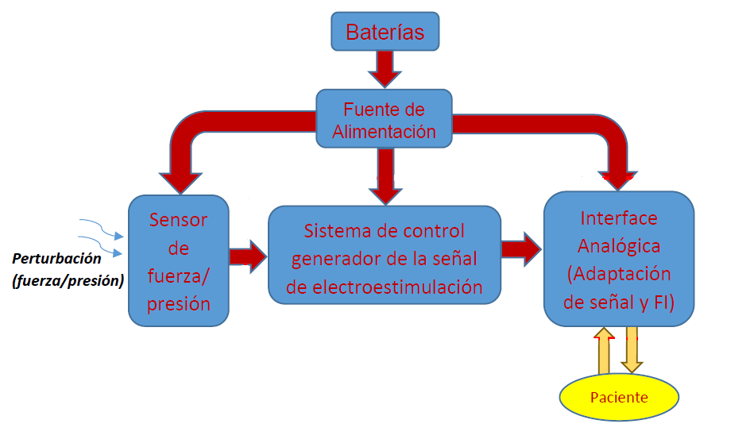
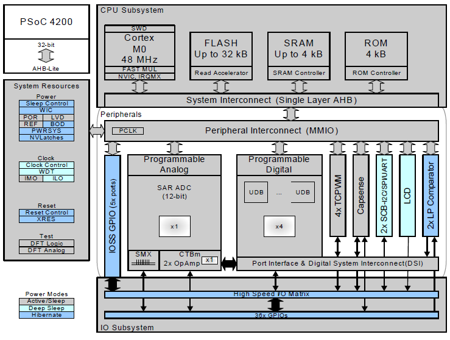
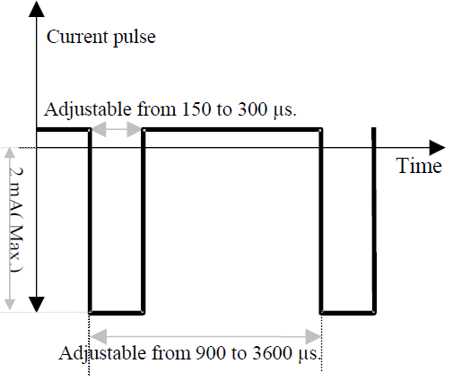
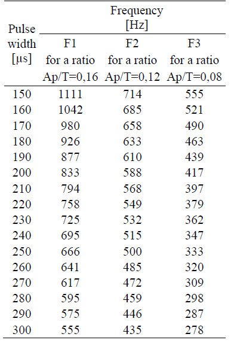

# MIB_sistema_p_realimentacion_haptica

 
Respositorio del Proyecto asociado a la Tesis de la Maestría en Ingeniería Biomédica de la FI-UNER, titulada "Diseño de sistema háptico para realimentación táctil no invasiva en protesis de miembro superior".
Con el desarrollo de este proyecto se busca diseñar un sistema que permita generar una realimentación táctil efectiva, de manera no invasiva, aplicable a prótesis de miembro superior para la incorporación de sensibilidad táctil a la misma.
Considerando la totalidad del sistema, el mismo puede ser representado mediante los bloques funcionales presentados en la Figura 1:

  

<h4 align="center">Figura 1: Diagrama en bloques del sistema completo.</h4>

El primer bloque implementado (Sistema de Control), consta esencialmente de una placa de prototipado basada en un microcontrolador PSoC-4 de la empresa Cypress, bajo el código CY8CKIT-049-42xx, cuyo núcleo se vale del integrado CY8C4245AXI-483, el cual posee una estructura interna según el siguiente diagrama:

  

<h4 align="center">Figura 2: Diagrama en bloques del integrado CY8C4245AXI-483, núcleo de la placa de prototipado CY8CKIT-049-42xx de Cypress.</h4>

Junto con la placa mencionada, se encuentran conectados unos periféricos básicos para la interface del usuario con el menú de configuración. Puntualmente una pantallas LCD de 16x2 y tres pulsadores.
Mediante los comando ingresados con los mencionados pulsadores (tres) y la pantalla LCD, se interactúa con un menú que permite configurar los parámetros de electroestimulación, dentro de rangos de frecuencia y ciclos de trabajo discretos estandarizados y niveles de corriente limitados por hardware en el bloque de interface analógica. La forma de onda de la señal de electroestimulación es cuadrada-bipolar de valor medio nulo, con frecuencias de trabajo configurables entre los 278Hz y 1111Hz, y ciclos de trabajo de 8%, 12% y 16%, según se detallan en la Figura 3 y Tabla 1 siguientes:

  
        
        
    

<h4 align="left">Figura 3: Forma de onda de electroestimulación por corriente.  Tabla 1: Periodo, frec. y ciclo de trabajo para electroestimulación.</h4>

Tanto la estructura de la señal como los parámetros característicos de la misma, tienen su fundamento en antecedentes de trabajos basados en el uso de electroestimulación por corriente para la generación de sensación táctil en no videntes o disminuidos visuales, a fin de implementar dispositivos para la lectura de texto Braille digitalizado, como se expone en [1] y [2].
El segundo bloque implementado (Interface Analógica) puede dividirse en dos etapas, en primera instancia y conectada directamente con el Sistema de Control, se encuentra un circuito basado en AO, que adaptan la señal del IDAC (Conversor Digital Analógico de Corriente) del PSoC 4, para la interacción con la fuente de corriente de salida, que conecta directamente con el usuario (sujeto que recibe la electroestimulación) y generan la limitación de corriente de salida por hardware.
En segundo lugar se encuentra la fuente de corriente propiamente dicha, compuesta por seis transistores BJT complementarios, de alta tensión de colector-emisor y baja potencia. Esta última etapa se nutre de una fuente partida de alta tensión (±150V) para aplicar la corriente de electroestimulación de manera efectiva, para resistencias de interface electrodo-piel de hasta 75kΩ.
En función de lo detallado precedentemente, se desprende que el PCB necesario corresponde a una etapa del desarrollo de la Tesis, a los fines de dinamizar las pruebas del prototipo previo a su ensayo en pacientes. El mismo debe contener los dos bloques descriptos anteriormente, debiendo manipular señales rectangulares de hasta 1,1kHz y con los recaudos necesarios para los tramos de alta tensión de alimentación, tanto en la selección de los transistores de salida como en el distanciamiento entre pistas en la región del circuito correspondiente.

